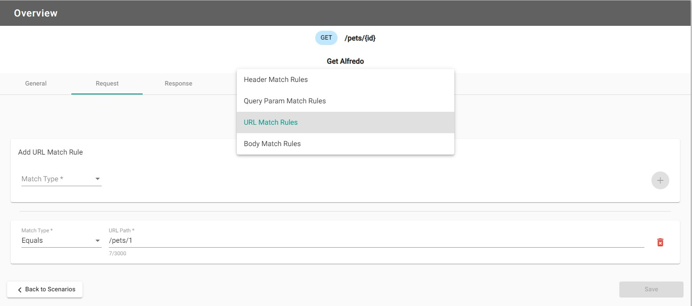
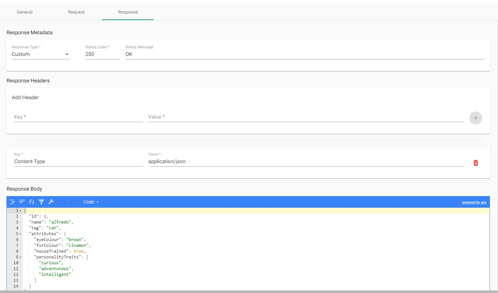

# Orbital-Demo

## Table of Contents 
  - [Introduction](#introduction)
  - [Orbital OpenApi Specification](#orbital-openapi-specification)
    - [Introduction](#introduction-1)
    - [Creating an OpenAPI document](#creating-an-openapi-document)
    - [Orbital Considerations](#orbital-considerations)
    - [Troubleshooting](#troubleshooting)
  - [cURL Bash Script](#curl-bash-script)
    - [Introduction](#introduction-2)
    - [Pet Store cURL Bash Script](#pet-store-curl-bash-script)
    - [Running the Script](#running-the-script)
  - [Designing Mock Definitions](#designing-mock-definitions)
    - [Creating a Mock Definition](#creating-a-mock-definition)
    - [What is a Scenario?](#what-is-a-scenario)
    - [Creating scenario for GET pet by ID](#creating-scenario-for-get-pet-by-id)
    - [Downloading Mock Definitions](#downloading-mock-definitions)
    - [Saving progress](#saving-progress)
    - [Exporting to Mock Server](#exporting-to-mock-server)
  - [Running demo in Docker](#running-demo-in-docker)
  - [References](#references)

----

## Introduction
This repo contains the project demonstrating expected usage of Orbital within a development team. This includes a simple web app built with Angular to send HTTP requests to the mock server, receiving JSON payload based on the scenarios configured from a created mock definition. An additional docker directory is enclosed to demonstrate how to configure an server image from Dockerhub with a local mock definition and stand it up for immediate use. 

For the complete breakdown of Orbital, please visit the [Official Orbital Mock Website](https://orbitalmock.com/docs/about-us/) 

----

## Orbital OpenApi Specification

### Introduction
The OpenAPI Specification (OAS) defines a standard, language-agnostic interface to RESTful APIs which allows both developers and computers to discover and understand the capabilities of the service without access to source code, documentation, or through network traffic inspection. When properly defined, a consumer can understand and interact with the remote service with a minimal amount of implementation logic. `[1]`


The output of an OpenAPI Specification is a document or documents that define the API. The format is usually `YAML` or `JSON`, however YAML is the preferred standard due to its human-readable syntax. 


### Creating an OpenAPI document 
Recommended Text Editors:
- VSCode IDE with 'YAML' (Red Hat) extension 
- [Swagger Editor](https://editor.swagger.io/)
- Sublime with 'Pretty YAML' plugin


For Orbital, a sample OpenAPI document in YAML can be located within the [Orbital-Demo](https://github.com/FociSolutions/Orbital-Demo/blob/develop/Samples/pet-store-example.yml) repository.

The `pet-store-example.yml` sample document serves to assist developers with syntax, indentation formatting and pathing specifications. **For further information on troubleshooting OpenAPI documents, please refer to the [Swagger OpenAPI documentation](https://swagger.io/specification/)**


### Orbital Considerations
- Currently compatible with Swagger 2.0. Ensure the version at the top of the document specifies `swagger: '2.0'`.
- When creating the mock definition from the OpenAPI specifications, the parser transcribes the verbs into specific JSON schemas, based on the path names given. 
- Default scenarios are generated based off the specific paths given.


### Troubleshooting
- As OpenAPI YAML formats work on a `key: value` structure, ensure the keys are unique for each path. If different HTTP methods rely on the same path, you can nest them within the path name. e.g. PUT, DELETE, GET by id are dependent on a `id` parameter in the URL therefore these methods can be nested with the `/pets/{id}` path.
- If different HTTP methods rely on the same `parameters`, you can declare them globally under the path name, and will be utilized across all endpoints. 
```
/pets/{petId}:
      parameters: 
          - name: id
            in: path
            required: true
            description: The id of the pet to retrieve
            type: string

        # Begin your HTTP Methods specification from this line downwards
```
- Depending on the amount of servers required, developers can specify the URL for different environments during stages of development. Each URL path shares the same key name `url` due to the preceeding `-` symbol denoting array types. 

```
servers:
  - url: https://localhost:5001/api/v1/OrbitalAdmin
    description: Basepath HTTPS URL when launching an Orbital instance for development

  - url: http://localhost:5000/api/v1/OrbitalAdmin
    description: Basepath HTTP URL when launching an Orbital instance for development
```

**NOTE: Utilizing `servers` key words may be incompatible with Swagger 2.0 version**. 
If working with newer syntax, consider indicating the version at the top of the file as OpenAPI version 3.0.x e.g. `openapi: 3.0.0`.  

- If working on a local text editor, for added confirmation of correct syntax, indentation, etc. copy/paste your working file into the [Swagger Editor](https://editor.swagger.io/) to confirm the specifications are readable YAML/JSON format. 

**For further information on troubleshooting OpenAPI documents, please refer to the [Swagger OpenAPI documentation](https://swagger.io/specification/)**

----

## cURL Bash Script

### Introduction
cURL is command line tool for doing "all sorts of URL manipulation and transfers" `[2]`. However, in this particular project, it is used to automate a series of HTTP requests to demonstrate the functionality of the Demo App.

### Pet Store cURL Bash Script
In order to demonstrate that the Pet Store Demo App is working in accordance to the specified Mock Definition contract as described in the .yaml file, a bash script is provided in the demo project, in the /Scripts folder in the root directory. The bash script is designed to hit the defined endpoints of /pets and /pets/{id} and demonstrates the following functionality:
- testing the GET action to /pets to get all pets, should get a 200 OK response
- testing the POST action to /pets, should get a 201 Created response
- testing the GET action to /pets/{id} to get the details of a specific pet, should get a 200 OK response
- testing the PUT action to /pets/{id} to update details of an existing pet, should get a 200 OK
- testing the PUT action to /pets/{id} to create a new pet with specified ID, should get a 200 OK
- testing the DELETE action to /pets/{id} to delete a specific pet, should get a 200 OK

### Running the Script
To run the script via terminal, follow the steps below. Firstly, ensure that you are serving the Demo App locally so that the cURL requests can reach the endpoints. 

**Step One: Ensuring the Script is Executable**
Secondly, the script should already be executable, but to ensure that it is:
1. Navigate to the /Scripts folder.
2. Execute the following command in terminal:
```
chmod +x ./PetStoreCurlTests.sh
```

**Step Two: Bash Command**
This can be run from any directory in the terminal or run by navigating to the directory and executing.
Run either of the following scripts in terminal depending on your current directory:
```
bash relative/path/to/Orbital-Demo/Scripts/PetStoreCurlTests.sh

#or if already in directory:
bash  ./PetStoreCurlTests.sh
```
The bash script should then execute and print what it is doing at each step, as well as the expected response. Then the actual response will be printed, and so on.

----

## Designing Mock Definitions

### Creating a Mock Definition

1. Go to the [Orbital Designer homepage](https://orbital-dev-designer.azurewebsites.net/) and click **"Create New Mock"**.

2. Enter in a title and description for the new mock.

3. Click **"Select File"** and provide a valid OpenAPI YAML file. For this guide, [OpenAPI Pet Store](https://github.com/FociSolutions/Orbital-Demo/blob/develop/Samples/pet-store-example.yml) is used. Download this file and provide it to the file selector.

4. Click **"Next"**.

5. The following endpoint view page will be displayed:


This page will display all endpoints defined in the uploaded YAML file. To the right of each row, the number of existing scenarios are indicated.

The next step in this guide will be to create a new scenario.

### What is a Scenario?

The purpose of a scenario is to describe what the endpoint will expect from the user's HTTP request and the response the user should expect from the endpoint. A scenario consists of:

- **Metadata**: A title and description to explain the purpose of the scenario.
- **Request Match Rules**: These rules will indicate what the user's HTTP request has to match to get a response from the server.
- **Response**: The server's response to the user's HTTP request.


### Creating scenario for GET pet by ID
1. Select an endpoint to add a scenario. This example will utilize the `GET /pets/{id}` option.

2. Click **"Add Scenario"**. `NOTE:` Upon creating the endpoints from the base YAML file, a **"Default OK Scenario"** will be checked. This can be unchecked or modified to act as the existing default should the Orbital filtration not find an appropriate match as a best scenario from front-end requests. 

3. Within the **"General"** tab under **"Metadata"**, enter a scenario name (required), and description (recommended).

4. An optional **"Policies"** configuration can be added to select delay response time from the request. Click the `"+"` button to add the policy. 

5. Click **"Save"** to save progress on the current tab. 

6. Switch to the **"Request"** tab and under the **"Request Rule Type"**, select the rules from the drop-down menu. In this example, select **"URL Match Rules"** to dynamically generate configuration options for constructing the URL string to match the HTTP request from the client. 
**`NOTE:` For the "URL Match Rules" option, the Orbital Server will use relative pathing to the base URL utilized to search for matching URL strings. In this example `/pets/1` was the URL path entered instead of the absolute path: `https://{hostname}:{port}/pets/1`**.



7. Click the `"+"` button to add the rule and **"Save"** to save progress on the current tab.  

8. Switch to the **"Response"** tab and under the **"Response Metadata"**, select the **"Repsonse Type"** and **"Status Code"**. For the `GET /pets/{id}` a status code of `200` is the standard response code for successful responses. 

9. Under **"Response Headers"**, ensure the header configuration matches the OpenAPI contract specificed in the YAML file for the particular endpoint. In this use case, `key: Content-Type,  value: application/json` is configured as the expected response payload will be in JSON format as per the OpenAPI specification. 

10. Click the `"+"` button to add the new response header.

11. Within the **"Response Body"**, insert the expected JSON payload in the text editor for the scenario. 



12. Click **"Save"** to save progress on the current tab.

13. Once complete, return to scenarios by clicking **"Back to Scenarios"** and return to endpoints main menu by clicking **"Back to Endpoints"**.


### Downloading Mock Definitions
1. Once all required endpoint scenarios are complete, select **"Download Mockdefinitions"** from the left-hand menu.

2. Via the download menu, select the mock definition for download or check **"Select All"** for all available mocks within the browser session. 


3. Click **"Download Selected"** and the file(s) will download automatically to the local file system. 


### Saving progress
1. To save working definitions for future sessions, follow the steps to locally download the current version of the mock definition. See **Downloading Mock Definitions** for further details. 

2. Navigate to the [Orbital Designer homepage](https://orbital-dev-designer.azurewebsites.net/) and click **"From File(s)"** under the **"Import an Existing Mockdefinition"**.

3. Select **"From File(s)"** and upload your existing file(s) and click **"Next"**.

4. The webpage should load and parse the JSON file with the applicable endpoints, requests, policies and responses intact.


### Exporting to Mock Server
1. On the left-side navigation menu, click **"Export Mock to Server"** to navigate to export current mock definitions to the target server. 

2. Specify the target server URI to upload active mock definitions. For the Orbital Server, https://localhost:5001/api/v1/OrbitalAdmin is the base URL to route endpoints to a centralised controller. 

3. Check the currently active mock definitions within your browser session (or check the **"Select All"** checkbox), and press `">"` or `"<"` buttons to move the definitions to stage for upload to the server. 

4. Once target files are selected within the **"Files Selected to Export"**, click **"Upload"**.

---

## Running demo in Docker
1. CD into src/orbital-demo/ 
2. Run command `docker-compose up` to start the demo in Docker. Orbital server will be using default mock_definition_valid.json file from Orbital-Demo git repository. You could also use your own mock_definition.json file saved locally or from a remote server by updating  .env
3. Open your browser and navigate to https://localhost:8080 to see the demo running. Orbital-Designer will be available at https://localhost:4200/, the Orbital Server - https://localhost:5001/api/v1/OrbitalAdmin

----

## References
`[1]` : [Swagger/OpenAPI Main Page](https://swagger.io/specification/) \
`[2]` : [Curl Scripting](https://curl.se/docs/httpscripting.html)